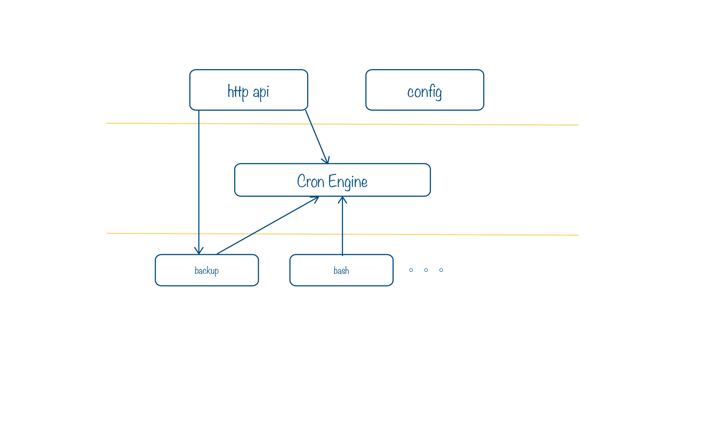

# backup

## 介绍

Backup 主要是为 Lain 集群上的 app 提供备份功能。使用者可在 lain.yaml 中配置 volume 的备份属性，对 volume 进行定时备份。

包含两部分，backupd 和 backupctl，即 daemon 和 controller。

## 整体设计

分两层，controller和daemon。controller负责任务的获取和记录等，daemon负责任务的执行。对于用户而言，daemon是隐藏的组件，所有的备份相关请求都要走controller。

### daemon

daemon以定时调度器为核心，即`cron-engine`。该模块具有定时调度的功能，并会把调度的结果post给指定的地址。engine所支持的任务类型，以插件的形式注册到engine上。

对volume的备份功就属于`cron-engine`的一个插件，我们通过api，把定时任务提交给`cron-engine`, engine就会根据设定在指定时间执行某插件。

controller 从lainlet中获取最新的配置并解析出备份任务，将任务发送给各个backupd-daemon。此外，还负责把一些查询的请求(如备份结果等)代理给某些daemon获取结果。



### controller

controller 的实现很简单，一个 goroutine 通过 watch lainlet 获取最新的备份任务。然后把任务发送给指定的 backupd。backupd 执行完任务后再讲结果 post 回给 controller。

controller 使用嵌入式数据库将任务执行记录存放到本地，并对外提供查询功能。


## 编译和运行

### 编译

**需要环境: go1.5+**
```sh
go build -o backupd
```

### 运行

**需要环境: lainlet, moosefs**

```sh
backupd --help 查看运行参数
```

## backup controller api

### 获取备份列表
```
curl /api/v1/backup/json/app/:appname/proc/:proc?volume=<volume1>&volume=<volume2>
```

### 手动执行一次备份
```
curl -XPOST /api/v1/cron/once/app/:appname/id/:id
```

### 执行一次恢复
```
curl -XPOST /api/v1/backup/recover/app/:appname/proc/:proc/file/:file
```

### 查看调度任务

```
curl /api/v1/cron/jobs/app/:appname
```

### 查看所有调度任务

```
curl /api/v1/cron/jobs/all
```

### 查看备份和恢复任务的历史

```
curl /api/v1/cron/records/app/:appname
```

### 查看备份和恢复任务的历史(指定id)

```
curl /api/v1/cron/record/app/:appname/id/:id
```


### 备份迁移到指定机器

```
curl -XPOST /api/v1/backup/migrate/app/:appname/proc/:proc/file/:file

postdata:
    volume: <volume>
    from: <instanceNo>
    to: <instanceNo>
```

### 增量备份恢复

```
curl -XPOST /api/v1/backup/recover/increment/app/:appname/proc/:proc/dir/:dir

postdata:
    instanceNo: intance number
    files: files to recover
```

### 增量备份迁移

```
curl -XPOST /api/v1/backup/migrate/increment/app/:appname/proc/:proc/dir/:dir

postdata:
    from: intance number
    to: instance number
    volume: migrate dir
    files: files to migrate
```

### 获取增量备份内的文件列表

```
curl /api/v1/backup/filelist/app/:app/proc/:proc/dir/:dir
```


## API v2

新的API，其实和旧的没什么区别，只是url看起来舒服些. 

v2的api中的proc值不需要写类似于`hello.web.web`的全名，直接写`web`就ok

**注:所有的api前面都要加`/api/v2`前缀**

#### 获取备份列表

```
GET /app/:app/proc/:proc/backups
```

#### 获取一个备份文件的信息

```
GET /app/:app/proc/:proc/backups/:filename?open=false

```
参数open可选,默认为false, 表示查看增量备份文件夹内文件列表。
如果filename指定的增量备份目录不存在，返回错误.

#### 删除备份文件

```
POST /app/:app/proc/:proc/backups/actions/delete

postdata:
    files: []string 要删除的文件
```

#### 备份恢复

```
POST /app/:app/proc/:proc/backups/:file/actions/recover

postdata:(可选)
    files: 列表  # 如果<:file>是增量备份, 则该参数指定备份目录下的文件列表, 全量备份不用

```

#### 备份迁移

```
POST /app/:app/proc/:proc/backups/:file/actions/migrate

postdata:
    volume: <volume>
    to: <instanceNo>
    files(可选): 如果指定的是增量备份，则需要指定要迁移的文件
```

#### 获取app的任务列表

```
GET /app/:app/cron/jobs
```

#### 获取一个app下的某一个任务的详情

```
GET /app/:app/cron/jobs/:id
```

#### 获取一个app的任务记录

```
GET /app/:app/cron/records
```

#### 获取一条任务记录

```
GET /app/:app/cron/records/:rid
```

#### 对某一条任务执行特定动作

action 支持 `run`

- `run`表示立刻执行一次任务

```
POST /app/:app/cron/jobs/:id/actions/:action
```

#### 查看一台机器上backupd的所有任务

```
GET /server/:ip/cron/jobs
```

#### 查看一台机器上backupd的debug信息

```
GET /server/:ip/debug
```
