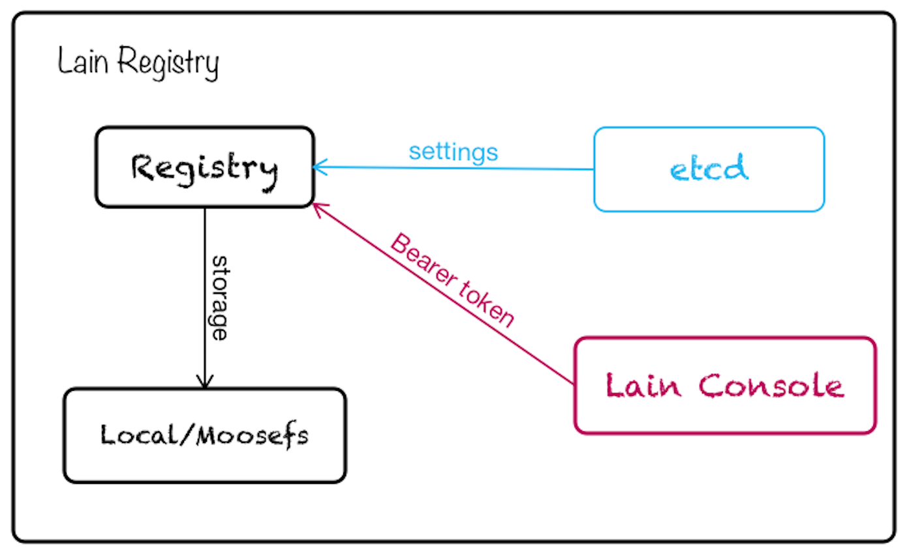

# Lain Registry

## 组件描述
Lain Registry 组件在 Lain 中主要用于 Image 存储，集群中所以的 Image 都由 Lain Registry 组件提供。组件目前使用的 Registry 的版本为 V2.0.1，计划升级到 V2.3.1，关于 Registry 的官方具体描述可以参见[这里](https://github.com/docker/distribution)。

Lain Registry 组件在官方 Registry 版本的基础上进行了 Lain 化。运维人员可以在 etcd 中进行一些配置，以更新 Registry 相应的设置，包括后段存储、Auth设置等。Lain Registry 组件默认使用本地磁盘作为存储后端，默认不使用 Auth。

## 组件顶层设计

Lain Registry 仓库地址为： `https://github.com/laincloud/registry`

Lain Registry 的组件架构图如下所示：

Lain Registry 采用的 Base Image 为使用官方 Registry V2.0.1 构建好的 Image，在启动 Lain Registry Container 时，会从 etcd 中读取一些配置，然后以这些配置为基础结合提供的 config.yml 文件运行 Registry。

默认情况下组件会将 Image 存放在本地磁盘的 `/var/lib/registry` 目录下，也可以通过配置 moosfs 来实现集群分布式存储；

默认情况下组件不开启 Auth，但是 Lain 中也提供了 Registry 的 auth server，即 Lain Console，可以在 etcd 中设置相应的 Auth 信息，Lain 中使用的 Registry Auth 方式遵照官方实现，具体可以参见[这里](https://docs.docker.com/registry/spec/auth/token/)

## 使用方法
### Auth 设置
集群中由 Lain Console 作为 Lain Registry 的 auth server，API为`api/v1/authorize/registry/`

1. Open Auth 

- 首先在 etcd 中设置：` etcdctl set /lain/config/auth/registry '{"realm":"http://console.<domain>/api/v1/authorize/registry/", "issuer":"auth server", "service":"<domain>"}'`
    
    其中的参数对应如下，详细介绍可以参考[这里](https://docs.docker.com/registry/configuration/#token)：
    
    > realm： 提供 registry auth 的地址
    
    > issuer： auth server 与 registry 之间约定的 issuer
    
    > service： 在 Lain 中设置为当前集群域名

- 重启 registry 容器

2. Close Auth
- `etcdctl rm /lain/config/auth/registry`
- 重启 registry 容器

### 储存后段设置
TODO
