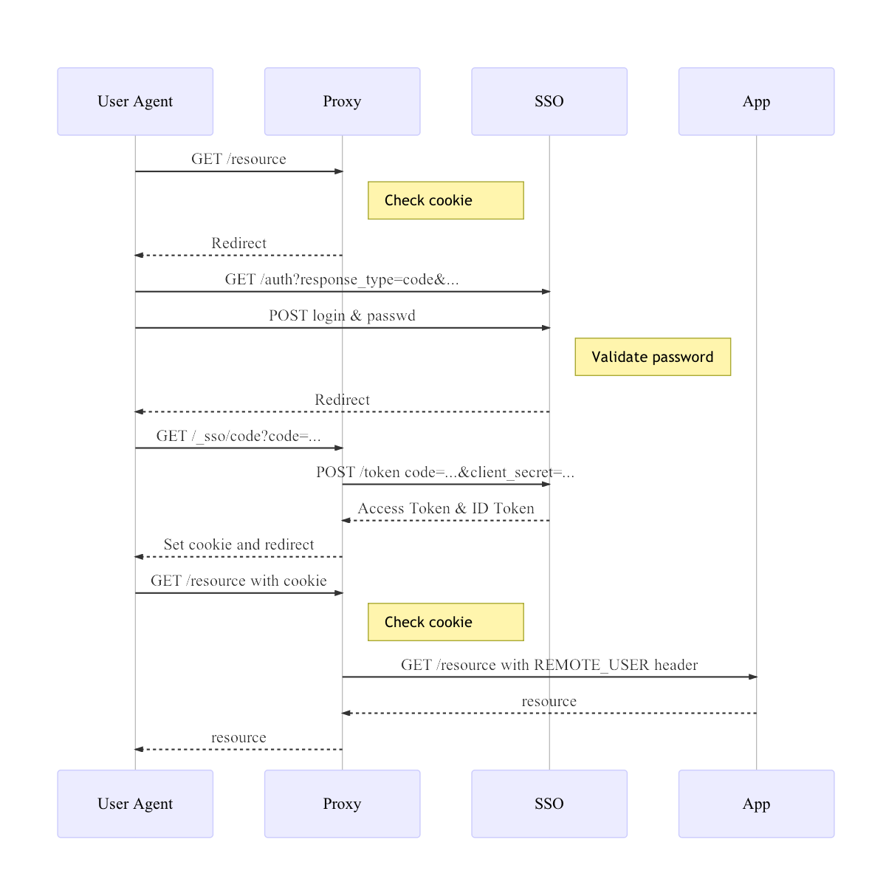

# sso nginx proxy 

## 使用方法

按照如下过程部署 proxy:

1. 修改 conf 目录下的 config.yaml, 目前不支持修改该文件名
2. 运行 ```luajit auto_config.lua``` 生成 nginx 配置片段

注意：若对 location 的匹配有顺序要求，需要开发者自己调整生成的 nginx 配置的 location 顺序.

### 关于 config.yaml

我们结合如下的 config.yaml 示例来解释每一项配置的作用.

```yaml
issuer: "https://sso.lain.bdp.cc"
upstream: "http://127.0.0.1:8002"
oauth2_client:
  redirect_uri: "http://openresty-test.yxapp.xyz/authorize"
  id: "23"
  secret: "wpux1dtOdBzN6flwQpaFCQ"
  csrf_cookie_name: "csrfunknown"
location:
  - auth_type: "password"
    match: "= /money"
  - auth_type: "sms"
    match: "~ \.(gif|jpg|jpeg)$" 
  - auth_type: "password sms"
    match: "~ /score"
  - match: "~ /api" # by default, auth_type is "password"
  - auth_type: "none" 
    match: "~ /hello"
```

- issuer: 必选。另外，我们通过这个配置推断出 sso 的其他配置，如 [这里](https://sso.yxapp.in/.well-known/openid-configuration) 所输出的配置。但我们在 lua 中并没有访问该 api, 当 sso 的相关配置改变时，请同时修改改 nginx proxy 相关的 lua 代码。
- upstream: 必选。由于哪些页面需要 sso 认证是可以配置的，不需要认证的页面直接会被代理至 upstream.
- oauth2_client: 该对象是指 oauth2 中所定义的 client, 需要 app maintainer 提前在对应 sso 中注册。csrf_cookie_name 是 app 定义的一个 cookie 名字，用来预防 csrf 攻击。需要说明的是，该对象下的4个属性中，id 和 secret 是必选的，当不设置 redirect_uri 时，相当于 ```redirect_uri = ${scheme}://${http_host}/_sso/```；csrf_cookie_name 的默认值为 sso_csrf.
- location: 对应于 nginx 配置的 location. 该对象下是一个列表，每个列表规定了 2 种配置定义，其中，只有 match 是必写的.
	- auth_type: 可能的选项为 "sms" "password" 等，也可以是它们的任意组合，该机制的进一步完善需要 sso 支持。默认情况下为 "password". 另外，如果 auth_type 为 "none"，代表该 location 不需要登录，自然此时 group 不能为 true.
	- match: ```[ = | ~ | ~* | ^~ ] /uri```, 注意 nginx 的 location 匹配规则有四种情况，具体含义请参考 nginx 文档。 

### eg：生成一个只有 /hello\* 不需要登录的 nginx conf

```yaml
issuer: "https://sso.lain.bdp.cc"
upstream: "http://127.0.0.1:8002"
oauth2_client:
  id: "24"
  secret: "rvI9rcGyoRHknPsf-fCc_w"
  csrf_cookie_name: "csrf"
location:
  - auth_type: "none"
    match: "~ /hello"
  - match: "~ /"
```
对应生成的 auto.conf

```
        set $myuser nginx;
        set $user_groups nginx;
        set $sso_upstream localhost;
        location ~ /hello{
                proxy_pass http://127.0.0.1:8002;
        }
        location ~ /{
                rewrite_by_lua_file ./conf/rewrite.lua;
                proxy_pass $sso_upstream;
                proxy_set_header REMOTE-USER      $myuser;
                proxy_set_header USER-GROUPS $user_groups;
        }
        location ~ /_sso/{ 
        # 虽然这里不生效，但事实上由于上一条经过了 rewrite.lua, 没有问题
                rewrite_by_lua_file ./conf/rewrite.lua;
        }
        location /{
                proxy_pass http://127.0.0.1:8002;
        }
```

### eg: 生成一个只有 /finance 需要登录的 conf

```yaml
issuer: "https://sso.lain.bdp.cc"
upstream: "http://127.0.0.1:8002"
oauth2_client:
  id: "24"
  secret: "rvI9rcGyoRHknPsf-fCc_w"
  csrf_cookie_name: "csrf"
location:
  - match: "~ /finance"
```
生成如下的 conf 文件

```conf
        set $myuser nginx;
        set $user_groups nginx;
        set $sso_upstream localhost;
        location ~ /finance{
                rewrite_by_lua_file ./conf/rewrite.lua;
                proxy_pass $sso_upstream;
                proxy_set_header REMOTE-USER      $myuser;
                proxy_set_header USER-GROUPS $user_groups;
        }
        location ~ /_sso/{
                rewrite_by_lua_file ./conf/rewrite.lua;
        }
        location /{
                proxy_pass http://127.0.0.1:8002;
        }
```

## proxy in nginx 设计（修改中）

为了尽可能少的需要应用改动代码，以快速对遗留应用进行 SSO 登录和授权，设计了在应用前端使用一层代理来处理 sso 相关处理的架构。

```mermaid
sequenceDiagram
User Agent->> Proxy: GET /resource
Note right of Proxy: Check cookie
Proxy-->> User Agent: Redirect
User Agent->> SSO: GET /auth?response_type=code&...
User Agent->> SSO: POST login & passwd
Note right of SSO: Validate password
SSO-->>User Agent: Redirect
User Agent->> Proxy: GET /_sso/code?code=...
Proxy->> SSO: POST /token code=...&client_secret=...
SSO-->> Proxy: Access Token & ID Token
Proxy-->> User Agent: Set cookie and redirect
User Agent->> Proxy: GET /resource with cookie
Note right of Proxy: Check cookie
Proxy->> App: GET /resource with REMOTE_USER header
App-->> Proxy: resource
Proxy-->> User Agent: resource
```


### proxy in nginx

nginx 需要编译入 [lua\_nginx\_module](https://github.com/openresty/lua-nginx-module) 以获得使用 lua 编制脚本的能力。

使用 lua 编写 proxy 的功能。包括:

1. 对所有 url 非 `oauth2_client.redirect_uri` 的请求，检查 cookie `sso`
    1. 是否存在
    1. 如果存在，cookie 应当为一个 jwt (json web token), 语义上为一个 id_token 
        * 首先检查 jwt 是否有效，该步主要检查了 sso 的签名是否正确，是否超时
        * 其次检查 id\_token 满足设置的认证方式，即检查其内容，是否包含要求的 scope.
        * ~~验证 sso 的组权限~~ (组权限在应用内部管理?)

1. 如果以上检查任意一项未通过，则返回 302 重定向:

    ```
    HTTP/1.1 302 Found
    Location: ${config.sso_auth_endpoint}
        ?response_type=code
        &redirect_uri=${oauth2_client.redirect_uri}
        &realm=${config.realm}
        &client_id=${oauth2_client.id}
        &scope=openid ${auth_type}
        &state=${csrf}:${urlquote(ngx.var.request_uri)}
    Set-Cookie: ${oauth2_client.csrf_cookie_name}=${csrf}; Path=/; HttpOnly;
    ```

    其中 `csrf` 为 request 中 cookie `${oauth2_client.csrf_cookie_name}` 的值，如果无此 cookie ，则随机生成一个值，base64url 格式。csrf 用来防御 [Cross-Site Request Forgery 攻击](https://tools.ietf.org/html/rfc6749#section-10.12)。

1. 如果访问的 url 是 `oauth2_client.redirect_uri` ，则检查 `state` 参数的值的第一部分与 `${oauth2_client.csrf_cookie_name}` cookie 中的值是否一致
    1. 如果不一致，或者无 `sso_csrf` cookie,  返回 403 Forbidden.
    1. 如果一致，使用 code 向 SSO 交换 ID token:

        ```
        POST ${config.sso_token_endpoint}
        Content-Type: application/x-www-form-urlencoded

        code=${code}&
        client_id=${oauth2_client.id}&
        client_secret=${oauth2_client.secret}&
        redirect_uri=${oauth2_client.redirect_uri}&
        grant_type=authorization_code
        ```
    1. 如果成功换得 ID token，即收到如下 JSON:

        ```json
        {
            "access_token": "...",
            "id_token": "...",
            "expires_in": ...,
            "token_type": "Bearer",
            "refresh_token": "..."
        }
        ```
         
        1. 设置 cookie_sso 为 ID token
        ```
        Set-Cookie: sso=${id_token}; Path=/; HttpOnly;
        ```
        2. 重定向至 state 参数的第二部分
          

1. GET /resource with cookie
 	1. 按照第一步的方法检查 cookie `sso`
 	2. 若通过检查，则解析 id_token 的 user_info 的 email 值作为 remote-user header
 	3. **若 config.yaml 中，该页面对应 groups 为 true, 则调用 sso 的 api?, 用 id_token 换 groups 信息** 
	1. GET /resource with REMOTE\_USER header and User\_Groups header
	2. App 信任该 header，检查用户，进行授权

该功能还未开发完善，也没有在 Lain 上部署.
可以参考 [demo](http://laingit.bdp.cc/chaoyiwang/proxy-example.git)
