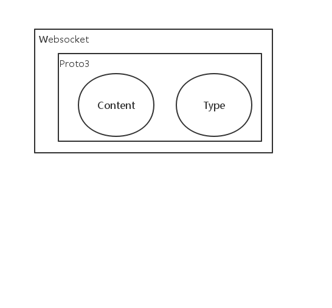

# [Entry](#entry)

**Entry** 是 LAIN 的 layer2 的一个特殊应用，允许开发者通过 `lain enter` 命令或者 console 的 web 界面远程登录到具有本人管理权限的容器中。

该效果等同于在 LAIN 的节点上执行 `docker exec -it $container_id /bin/bash`。

对于没有权限登录节点的开发者，使用 **Entry** 远程进入自己的容器调试是不错的选择。

使用前要注意

> **Entry** 由于需要访问集群的特殊资源，必须要由集群管理员部署，Entry的管理员也必须只能是集群管理员。
>
> **Entry** 使用前要确保集群的 sso 验证机制已经打开，否则客户端可以通过构造 http(s) 的 header 进入其他应用的容器。

## [Administrator Guide](#admin-guide)

- 下载代码，执行LAIN应用构建工作流 `lain build/tag/push/deploy`

- 允许 **Entry** 访问 `swarm.lain`

    集群中任意节点执行

    ```
    ETCD_AUTHORITY=127.0.0.1:4001 calicoctl profile entry rule show
    ```

    可能会有以下输出

    ```
Inbound rules:
    1 allow from tag lain
    2 allow from tag entry
Outbound rules:
    1 deny tcp to ports 9003 cidr 192.168.77.0/24
    2 deny tcp to ports 9002 cidr 192.168.77.0/24
    3 deny tcp to ports 7001 cidr 192.168.77.0/24
    4 deny tcp to ports 4001 cidr 192.168.77.0/24
    5 deny tcp to ports 2376 cidr 192.168.77.0/24
    6 deny tcp to ports 2375 cidr 192.168.77.0/24
    7 allow
    ```

    根据 swarm-agent 的端口去掉 outbound 的 deny 规则 (默认端口为2376)

    ```
    ETCD_AUTHORITY=127.0.0.1:4001 calicoctl profile entry rule remove outbound deny tcp to ports 2376 cidr 192.168.77.0/24
    ```

- 允许 **Entry** 访问 `lainlet.lain`

    将 **Entry** 加入到白名单应用中

    ```
    etcdctl set /lain/config/super_apps/entry {}
    ```

## [User Guide](#user-guide)

当 **Entry** 安装并配置好后，直接在 LAIN-box 中通过 `lain enter` 命令或者在 console 的 web 界面中的容器信息页中点击*进入容器*即可进入自己具有管理员权限的应用的容器。

> `lain enter` 命令详见 [lain enter 命令文档](https://laincloud.gitbooks.io/white-paper/content/usermanual/sdkandcli.html#enter)
>
> 使用后请在终端通过 `exit` 命令安全退出，异常退出会使得容器中出现残留的 `bash` 进程
>
> `lain enter` 只支持进入具有 `/bin/bash` 程序的容器
>
> 需要 lain-cli 2.0.1及以上版本

## [Developer Guide](#developer-guide)

### [Architecture](#architecture)

** Entry ** 的工作流程如下

1. 开发者输入 `lain enter` 命令。
2. lain-cli 获取要进入的应用名称，proc 名称，实例编号，以及所用的终端类型和本地 `lain login` 时的缓存的 token，组成 Header，向服务端发送 websocket 请求。
3. 服务端在接收到请求后，响应 websocket upgrade。
4. 服务端进行权限验证以及获取容器 ID，如果未通过验证或者未找到容器 ID，则通过 websocket 返回连接关闭信息。
5. 服务端找到容器 ID 后， 通过调用 docker remote API 建立一个新的伪终端，并通过 websocket 在服务端和客户端传递伪终端的 stdin, stdout 和 stderr 流。

数据流程如下图所示


** Entry ** 通过 websocket 传递二进制格式的消息，消息的序列化与反序列化使用 protobuf3。

** Entry ** 的消息格式有两种，RequestMessaage 和 ResponseMessage。

### [RequestMessage](#requestmsg)
RequestMessage 是指客户端的输入信息，主要有两类

- PLAIN: 正常情况下用户在终端的任何输入，被转化为二进制数据后发送到 **Entry**。
- WINCH: 当用户终端的大小发生改变时，为了保证终端能够正常显示，需要捕获该事件，并将改变后的大小通知 **Entry**，然后通过 ResizeExecTTY 接口改变容器终端的输出。

### [ResponseMessage](#responsemsg)

ResponseMessage 是指 Entry 返回给客户端的信息，主要有两类

- STDOUT: 容器终端的标准输出。
- STDERR: 容器终端的标准错误输出。
- CLOSE: **Entry** 发送的关闭连接的信息。
- PING: **Entry** 发送的检测 websocket 连接存活的信息，每 10 秒发送 1 次。

信息的协议栈如下图




### [Extension](#ext)

[Entry](https://github.com/laincloud/entry) 代码仓库既包含服务端又包含客户端代码。如果修改了 [message.proto](https://github.com/laincloud/entry/blob/master/message.proto)，需要同时通过 [protoc](https://github.com/google/protobuf) 同时更新 server 和 entryclient

```bash
protoc --go_out=./message message.proto
protoc --python_out=./ message.proto
```

如果发现 BUG 或有其他的功能需求，请在 github 提出 issue 和 pull request。
