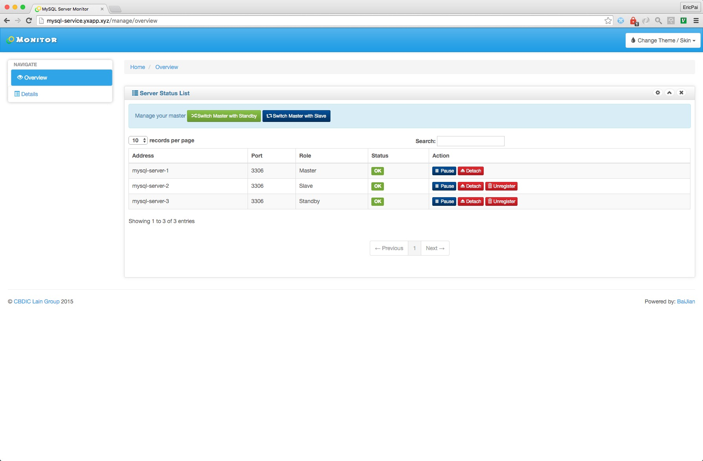
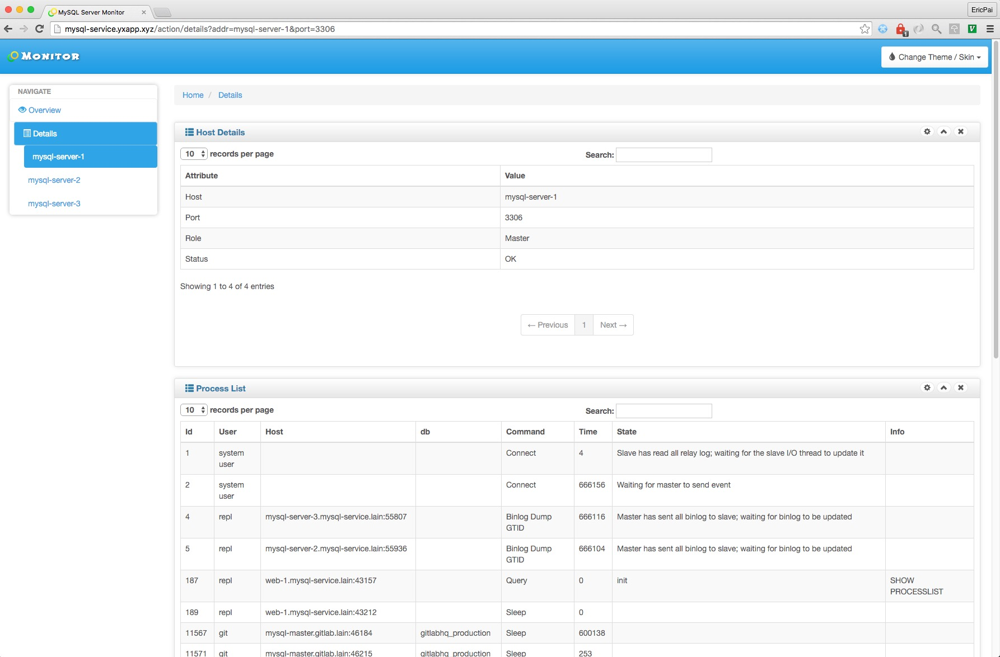
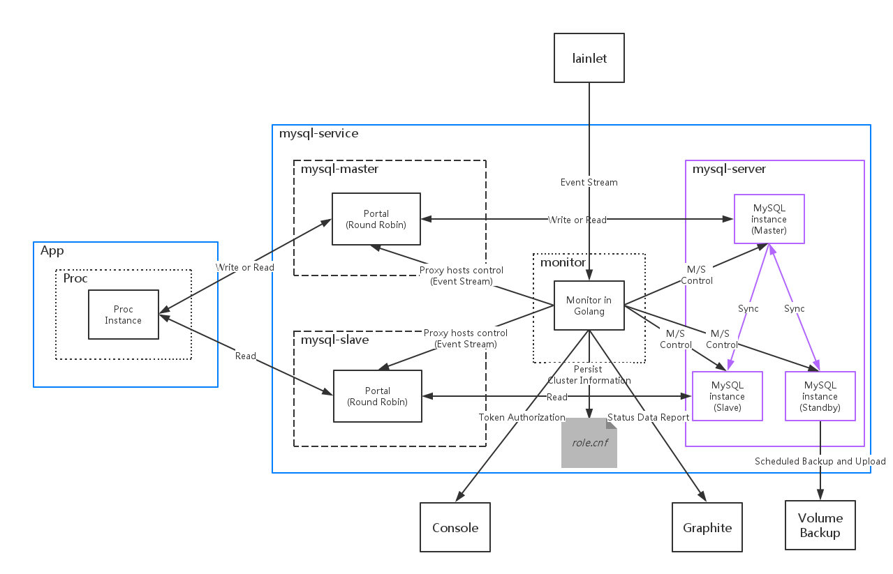

# MySQL service







## 1. 应用简介
MySQL Service是lain中能够提供稳定MySQL存储的layer2服务型应用。对于依赖mysql作为数据库的应用，MySQL Service是这些应用的首选。相对于直接部署在物理节点的MySQL，MySQL Service的主要功能有：
- 智能代理：MySQL service的portal是一个传输层的智能代理，能够根据实例的主从状态将MySQL的连接请求代理到正确的实例。
- 支持单主、单备、多从的多实例集群结构：由于MySQL Service是集群中的可选组件，因此在部署时可以选择多实例，并在运维的Web UI中将实例进行角色注册。
- 完善的主从、主备切换：在MySQL运维过程中，主从或主备切换是必不可少的工作。MySQL Service提供了较为完善的切换功能，能够最大限度地减少对客户端的影响。
- 人性化的Web UI：基于bootstrap构建的GUI，为数据库管理员(DBA)提供了一键注册实例、一键切主、一键建立数据同步的功能，使得DBA可以避免去编写繁杂的运维脚本，降低运维失误。
- 运行状态监控：在集群配置了监控系统（如Graphite）的情况下，可以将实例的运行状态实时上报至监控系统。
- 数据自动备份：在集群配置了**backupd**的情况下，可以通过backupd实现基于[percona-xtrabackup-2.2.12](https://www.percona.com/doc/percona-xtrabackup/2.2/release-notes/2.2/2.2.12.html)的全量物理备份以及增量的binlog备份。这两者都是数据恢复的基础。
- 密码安全保障：MySQL Service的root，repl，dba密码需要在应用部署前通过**secret file**机制注入到container内部的文件，避免了密码以明文的形式出现在代码库中。
- 身份验证：如果集群开启了sso验证机制，所有在Web上的运维操作都必须经过sso身份验证。且只有属于MySQL Service的用户组的用户（即DBA）才能通过身份验证。

MySQL Service适用的场景：
- 依赖MySQL数据库应用的测试。
- 流量、数据量适中的数据库应用运行。
- 不需要独占实例的数据库应用。

MySQL Service不适用的场景：
- 需要多主和HA。
- 需要独占实例（请使用MySQL Resource）。
- 数据库访问量巨大，对性能要求极高的。
- 有特殊运维需求的。

> MySQL Service依赖的lain组件：
> - lainlet（必需）
> - backupd（可选，自动备份依赖）
> - sso（可选，身份验证依赖）
> - lvault（可选，数据库初始化时root/repl/dba密码配置依赖）

### 一个基于 lvault 和 sso 的生产环境下配置样例
一般在生产环境下，需要打开 auth. 所以，首先需要去集群的 sso 注册一个应用，
然后便可以从 sso 的网站上看到 client ID 和 client secret. 下面可以对 mysql-service 进行配置。
mysql-service.web.web 和 mysql-service.worker.mysql-server 配置可以相同，
均为如下位于 /lain/app/conf/secret.conf 的文件:
```
dba_passwd=dba
repl_passwd=repl
root_passwd=root
sso_url=http://sso.lain.example
client_id=10
secret=ShjveL9AQfuQdasf
redirect_uri=http://mysql-service.lain.example
```


## 2 模块功能说明

### 2.1 系统架构图



### 2.2 Monitor

#### 2.2.1 初始化集群
mysql_monitor经过编译会生成monitord程序。monitord从lainlet中监听mysql-server的instance数量变化信息，同时从本地存储的配置文件中得到集群状态（第一次部署时文件中没有集群状态）。当集群状态改变时，monitor会将改变后的状态刷新到配置文件中。

#### 2.2.2 对MySQLProxy的SSE服务
monitord会启动Server Sent Event（SSE）服务。服务地址为`http://<monitor_host>:6033/servers`。当有新的MySQLProxy连接时，会发送init事件。当监听的lainlet推送update事件时，会发送update事件。
   SSE的推送的信息data字段的信息为json串，内容如下：

```json
{"master":
    {"containers":
        [{"container_ip" : "xxx",
          "container_port" : xxx
        }]
    },
 "slave":
    {"containers":
        [{"container_ip" : "xxx",
          "container_port" : xxx
         },
         {"container_ip" : "xxx",
          "container_port" : xxx
         }]
    }
}
```

#### 2.2.3 web控制台

monitor基于Go的beego web框架实现，提供了web可视化监控功能。部署后可以从http://mysql-service.LAIN_DOMAIN 进入首页。但是前提要登录过SSO并具有**mysql-service**的**write:group**权限。如果没有登录，web控制台会自动跳转回console的登录页面。

Overview页面展示了各个节点的工作状态，并且提供了主从、主备切换以及在master故障时的紧急切换（主备优先，如果没有standby则进行主从切换）。切换时的规则如下：

- 正常情况下的主备/从切换（Switch with standby/slave）: 如果切换前是单向主备，则切换后也为单向主备；如果切换前是互相主备，切换后也为互相主备。当standby/某个slave的状态为OK时，可以主动切换。
且切换成功只是保证实现了master和standby/slave的角色互换，不保证所有的slave均切换成功，因此还需要观察slave的运行状态是否为`OK`。
- 异常情况下的主备/从切换（Emergency Switch）: **只有master状态为`ERROR`时，才能进行该操作** 。并且优先执行主备切换，如果没有standby则任找一台slave做主从切换。该操作不保证切换后的master一定可用，并且不保证master－standby的关系不发生变化，同时也不保证所有的slave成功完成切换master。
因此当master挂掉时，建议结合Unregister操作以及进入容器调查等方式决定新的的master（例如将standby unregister并且将工作正常的slave unregister然后register为standby，这样Emergency Switch时就会进行主备切换）和决定是否执行Emergency Switch。

Overview页面还提供了注册、反注册；激活、分离；暂停、恢复等操作链接，每对操作均为互逆操作。其中规则如下：

- 节点一开始均处于`UNREGISTERED`状态，注册(Register)操作可以讲该节点注册到管理列表中，但其行为并未发生改变（即不会建立任何主从关系）。集群中可以注册最多一个master，一个standby，但是可以有多个slave。master注册后如果工作状态正常则状态值为`OK`，standby和slave则为`DETACHED`。
- 注册后的节点可以反注册（Unregister），从而可以从管理列表中删除。但是同样地，该操作不影响节点的行为。
- 注册后的standby和slave可以通过激活（Active）操作建立与master的主从关系，如果工作正常则状态为`OK`，如果与主节点同步连接正常但是数据不同步，则状态为`SYNING`。如果配置了standby，对master执行激活操作可以建立master到standby的反向主从，用于实现master和standby的互备。
- 激活的standby和slave可以通过分离（Detach）操作解除与master的主从关系，解除后其状态变为`DETACHED`。
- 任何运行正常的节点均可以通过暂停（Pause）操作暂停该节点的对外服务（主节点会设为只读，其他节点则会暂停slave），且状态均会变为`PAUSE`。
- 处于`PAUSE`状态的节点可以通过恢复（Resume）操作恢复该节点的对外服务。
- 如果standby和slave的Maste_Host和master不一致（多出现在该节点宕机时发生了主从或主备切换的情况），该节点的状态为`LOST`，此时通过Active操作即可恢复正常。
- 如果某个节点无法连接，则状态值为`ERROR`。
- 特别的，如果MASTER节点的状态是`ERROR`，则所有Active的slave和standby也会为`ERROR`。此时需要手动检查master的情况或者进行Emergency Switch了。

点击Details并在下拉菜单中选择某个节点则进入对应节点的详细信息页面，该页面展示了该节点的角色，而且如果该节点配置了master，则展示出该节点的SLAVE_STATUS。同时还有性能信息。表格中可以通过查找方式找到特定的项。

#### 2.4 向监控系统的状态数据推送

monitor在启动时会定期向监控系统推送所有实例的状态数据。

状态信息的获得目前包括：
 - `SHOW SLAVE STATUS`
 - `SHOW GLOBAL STATUS`
 - `SHOW GLOBAL VARIABLES`
 - `SHOW ENGINE InnoDB STATUS`

### 2.3 Proxy

#### 2.3.1 获取并更新目的地址信息

   mysql_proxy经过编译会生成proxyd程序。proxyd程序运行时需指定两个参数:

- `-p`: 监听客户端请求的端口号。既然是MySQLProxy，则建议设置为**3306**。
- `-m`: 转发模式。取值为slave或master，分别代表将数据转发到slave实例或master实例。

> 如果有多个slave实例，连接请求会随机代理到某一个实例上。

proxyd启动时连接monitor的SSE服务。当monitor推送事件时，proxyd会根据data更新目的地址列表，该过程是线程安全的。

> 由于proxyd是传输层代理，因此在切换目的地址时不会主动断掉旧的连接（防止直接断掉TCP连接后，MySQL无法收到`RESET`请求出现连接泄露）。中断连接的过程在MySQL服务端执行。

#### 2.3.2 监听客户端连接并转发数据

   proxyd会在启动时在`-p`设置的端口上监听来自客户端的TCP连接请求。

   当proxyd接收到客户端的连接请求后，会再建立一个goroutine处理该请求。新建立的goroutine会从目的地址列表中按照轮询的规则找到一个目的地址，在查找的过程会加上读锁。当确定地址后，会建立两个goroutine传输数据，分别传输client->target和target->client直至传输结束。
