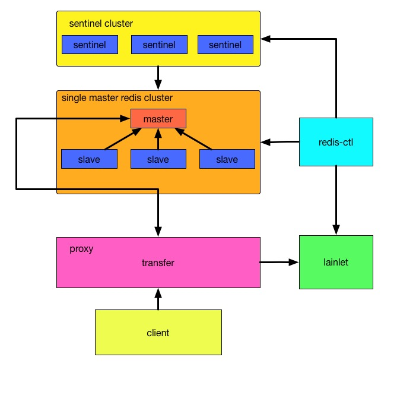
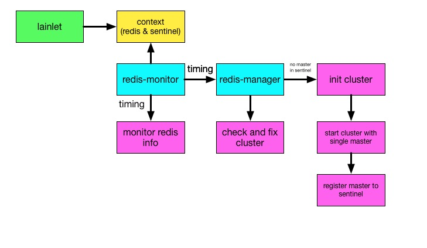
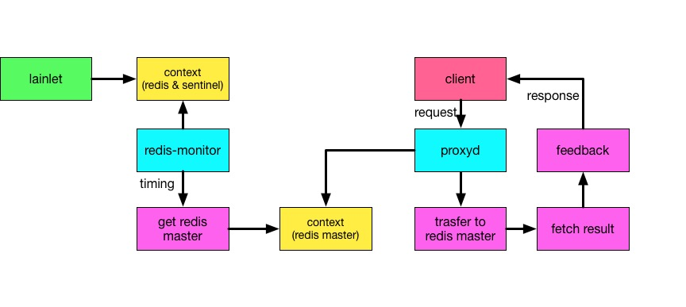

# 基本介绍

redis-service-sm 是基于redis2.0之后对redis 单主多从的自动化运维管理<br/>
对于redis 主从的介绍可以见[官方文档](http://redis.io/topics/replication)<br/>
文档对于单个redis Server都称作：redis节点
这是一个支持redis全操作的redis主备集群

# 整体设计：
整体设计图：


```
redis-service-sm 主要包括四个部分：
1.redis-cluster    以一主多备方式单master存在的redis cluster服务集群
2.redis-ctl        redis cluster的自动化管理程序
3.sentinel cluster 维护集群状态的sentinel集群，当master节点down了，会在一定时间后主动主从切换
4.proxy            与客户端连接的redis cluster代理
5.lainlet          提供service信息的发现服务

其中redis-ctl,proxy分别从lainlet获取分配给service的redis cluster节点信息及sentinel信息
redis-ctl  从lainlet中获取redis节点信息及sentinel信息，初始化集群，
           并将集群信息注册到sentinel，检查维护集群状态并将redis节点信息发送到监控收集服务
proxy      从lainlet中获取redis节点信息及sentinel信息，并获取当前的master节点，
		   将用户请求路由到master节点并返回用户操作结果
```

## 1.redis-ctl 设计


```
redis-ctl 负责单master的redis cluster的初始化及以后集群状态维护工作
包括两个daemon线程:redis_monitor,redis_manager
1. redis_monitor lainlet获取分配给redis cluster的redis节点信息，并将信息更新到全局context中，并将redis info信息推送到监控服务程序
2. redis_manager 从全局context中获取redis cluster中的redis节点信息，根据redis节点信息，
负责初始化redis cluster，并实现cluster状态的检测及维护
```


## 2.redis-proxy
设计图：


```
redis-cerberus 包括两个进程:proxyd 和 redis-monitor
proxyd: single master redis cluster的代理层，从client获取指令，将指令转发到指定的master，
        将获取到的结果进行解析后返回给client
redis-monitor: 定时从lainlet获取sentinel节点信息，及时更新master信息，以便proxyd能时刻连接
               到正确的master节点
```

## 3.redis-sentinel相关信息
redis sentinel是对redis主要是维护一组或多组redis主从信息，并当master节点故障时能进行自动主备切换


对于redis sentinel的基本介绍及配置见[官网](http://redis.io/topics/sentinel)


## 4.redis-service-sm 使用demo（python版）
见[代码](https://github.com/laincloud/redis-service-sm)

### 4.1编写lain.yaml
和lain service相关文档见[地址](http://docs.lain.bdp.cc/user/service/)

```
appname: redis-demo # app的名称

build:
  base: registry.lain.bdp.cc/centos-redis-cluster:1.0.0   
  prepare: #构建基本docker镜像的时候会执行以下指令
    - pip install -r pip-req.txt #安装python的相关依赖
    - rm -rf /lain/app/*
  script: #lain build的时候会执行以下指令
    - pip install -r pip-req.txt
    - cp redis-demo.sh /redis-demo

use_services: #使用service
  redis-service-sm:# service的appname
    - redis #指定的service app中的portal名

proc.redisdemo: #proc的名称
  cmd: /redis-demo #执行的指令
  memory: 128m #初始内存大小
  port: 9999 #该app开放的端口号
  num_instances: 1 #在lain中该proc启用的实例数
  persistent_dirs: #需要持久化的目录
    - /result
```

### 4.2编写demo代码：
redis_demo.py<br/>
在使用redis service中需要连接到对应的redis service portal，通过portal进行command操作

```
CERBERUS_HOST = 'redis.redis-demo.lain' #{portal}.{appname}.lain
CERBERUS_PORT = 8889
r = redis.StrictRedis(host=CERBERUS_HOST, port=CERBERUS_PORT, socket_timeout=TIMEOUT)
r.get(key)
r.set(key,value)
#在使用lain service的应用中，首先会找到lain中是否存在该service以及该service是否存在该portal
#如果满足以上条件，lain会在集群部署了该demo应用的node中构建一个名为
#{serviceappname}.portal.portal-{nodename}-{demoappname}的container，
#并通过tinydns注册相关域名{portalname}.{demoappname}.lain,如此便可以通过该域名访问redis service了
#redis service single master portal开放的端口为8889
```
